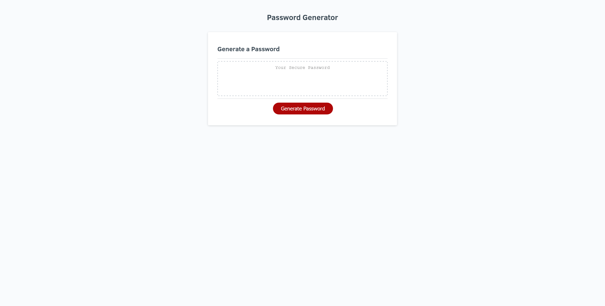

# PasswordGenerator

Generates a password to the users specifications, with a length between 8 and 128 characters.

Optionally including lowercase, uppercase, numbers, and special characters.

[Deployed Website](https://alexandergalen.github.io/PasswordGenerator/)

